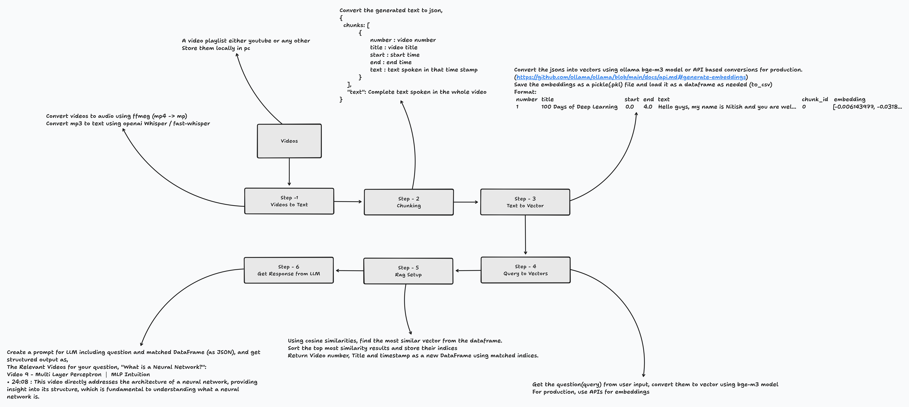

<div align="center">

# AI Teaching Assistant

### Semantic Search Engine for Deep Learning Lectures

An AI-powered assistant built with **Retrieval-Augmented Generation (RAG)** that helps students instantly locate concepts inside Deep Learning video lectures — with exact timestamps.

[](https://deeplearning-rag-assistant.vercel.app/)
[](https://github.com/daivagnaa/AI-Teaching-Assistant---RAG-Based)
[](https://python.org)
[](https://flask.palletsprojects.com/)
[](https://ai.google.dev/)

---

**Stop scrubbing through hours of lectures. Ask a question, get the exact timestamp.**

[Live Demo](https://deeplearning-rag-assistant.vercel.app/) · [Report Bug](https://github.com/daivagnaa/AI-Teaching-Assistant---RAG-Based/issues) · [Request Feature](https://github.com/daivagnaa/AI-Teaching-Assistant---RAG-Based/issues)

</div>

---

## The Problem

Students often spend significant time scrubbing through lengthy lecture videos to find specific explanations. Traditional search only matches titles or keywords — it can't understand *what* was actually taught in the video.

## The Solution

This AI Teaching Assistant uses **semantic search** over lecture transcripts. Instead of matching keywords, it understands the *meaning* behind your question and finds the exact moments in lectures where the concept is explained — complete with clickable timestamps.

---

## Features

| Feature | Description |
|---------|-------------|
| **Semantic Search** | Ask natural language questions and find relevant lecture moments |
| **Exact Timestamps** | Jump directly to the relevant explanation in the video |
| **AI-Powered Summaries** | Each result includes a concise description of what's covered |
| **Multi-Video Results** | Finds relevant explanations across all 17 course videos |
| **Instant Results** | Get answers in seconds, not minutes of scrubbing |
| **Smart Filtering** | Irrelevant or off-topic questions are handled gracefully |
| **Responsive Design** | Works seamlessly on desktop and mobile devices |

---

## Architecture

<div align="center">



</div>

---

## Tech Stack

<table>
  <tr>
    <td align="center"><b>Category</b></td>
    <td align="center"><b>Technology</b></td>
  </tr>
  <tr>
    <td>Backend</td>
    <td>Python, Flask</td>
  </tr>
  <tr>
    <td>AI / LLM</td>
    <td>Google Gemini 2.5 Flash, Gemini Embedding API</td>
  </tr>
  <tr>
    <td>Embeddings</td>
    <td>Gemini Embedding 001 (3072 dimensions)</td>
  </tr>
  <tr>
    <td>Similarity Search</td>
    <td>Cosine Similarity (scikit-learn)</td>
  </tr>
  <tr>
    <td>Frontend</td>
    <td>HTML, CSS, JavaScript</td>
  </tr>
  <tr>
    <td>Deployment</td>
    <td>Vercel (Serverless Python)</td>
  </tr>
  <tr>
    <td>Speech-to-Text</td>
    <td>OpenAI Whisper (preprocessing)</td>
  </tr>
</table>

---

## Project Structure

```
AI-Teaching-Assistant/
│
├── app.py                    # Flask application & API routes
├── rag.py                    # Core RAG pipeline (embedding, retrieval, generation)
├── video_link.py             # YouTube video URL mappings
├── merge_chunks.py           # Transcript chunk merging utility
│
├── templates/
│   ├── landing.html          # Landing page
│   └── index.html            # Main search interface
│
├── static/
│   ├── css/style.css         # Styling
│   ├── js/script.js          # Frontend logic
│   └── images/               # Assets
│
├── Embeddings/
│   └── gemini_embeddings.pkl # Pre-computed embeddings (3,239 chunks)
│
├── 0. Pre Processing/        # Video download & preprocessing
├── 1. Speech to Text/        # Whisper transcription pipeline
├── 2. Text To Vector/        # Embedding generation scripts
├── 3. Query To Vector/       # Query embedding experiments
├── 4. Rag Setup/             # RAG pipeline development
│
├── requirements.txt          # Python dependencies
├── vercel.json               # Vercel deployment configuration
└── .vercelignore             # Files excluded from deployment
```

---

## Getting Started

### Prerequisites

- Python 3.10+
- A [Google Gemini API Key](https://aistudio.google.com/apikey)

### Installation

1. **Clone the repository**

   ```bash
   git clone https://github.com/daivagnaa/AI-Teaching-Assistant---RAG-Based.git
   cd AI-Teaching-Assistant---RAG-Based
   ```

2. **Install dependencies**

   ```bash
   pip install -r requirements.txt
   ```

3. **Set up environment variables**

   Create a `.env` file in the root directory:

   ```env
   GEMINI_API_KEY=your_gemini_api_key_here
   ```

4. **Run the application**

   ```bash
   python app.py
   ```

5. **Open in browser**

   Navigate to `http://localhost:5000`

---

## How the RAG Pipeline Works

### 1. Preprocessing (Offline)
- 17 Deep Learning lecture videos are downloaded from YouTube
- Audio is extracted and transcribed using **OpenAI Whisper**
- Transcripts are split into overlapping chunks with timestamps

### 2. Embedding (Offline)
- Each transcript chunk is embedded using **Gemini Embedding 001**
- Produces 3,072-dimensional vectors for 3,239 chunks
- Embeddings are stored as a pickle file for fast loading

### 3. Query Processing (Runtime)
- User's question is embedded using the same Gemini model
- **Cosine similarity** is computed against all stored embeddings
- Top matching chunks are retrieved (with relevance filtering)

### 4. Answer Generation (Runtime)
- Retrieved chunks are sent to **Gemini 2.5 Flash**
- LLM merges, ranks, and summarizes the relevant segments
- Returns structured results with video numbers and timestamps

---

## Implementation Approaches

This project can be implemented in two ways depending on your use case:

| Approach | Embeddings | LLM Response | Deployment |
|----------|-----------|--------------|------------|
| **API-Based (Current)** | Gemini Embedding API | Gemini 2.5 Flash API | Works both locally and in production (Vercel, etc.) |
| **Local Models** | BGE-M3 | Any local LLM (LLaMA, Mistral, etc.) | Limited to local usage only |

**API-Based** is recommended for production deployments since it requires no GPU and works on any serverless platform. The **Local Models** approach is ideal for offline usage, full privacy, or when you want to avoid API costs — but it requires sufficient hardware and cannot be deployed to serverless platforms like Vercel.

---

## Learning Resource

All lecture transcripts are sourced from the sample size of 17 videos from **100 Days of Deep Learning** playlist by [CampusX](https://www.youtube.com/@campusx-official) — an excellent resource covering deep learning fundamentals.

[](https://youtube.com/playlist?list=PLGMBjWR7dGL_XFUbQQhJIaojuDhWF35yk&si=eIeeIz_EarAnOnVI)

---

## Roadmap

- [x] Semantic search across 17 lecture videos
- [x] Timestamped results with AI-generated descriptions
- [x] Responsive design (mobile + desktop)
- [x] Deployed on Vercel
- [ ] Search History
- [ ] Bookmarks
---

## Developer

Connect with the project maintainer:

[](mailto:devparmar1895@gmail.com)
[](https://www.linkedin.com/in/daivagna-parmar-949315316)
[](https://github.com/daivagnaa)

---

## License

This project is open source and available for learning purposes.

---

<div align="center">

> **Version Notice**
>
> This is **V0** (initial release) of the AI Teaching Assistant.
> Features like **History** and **Bookmarks** are currently under development and will be fully functional in upcoming releases. Stay tuned!

---

**If you found this project useful, consider giving it a star!**

[](https://github.com/daivagnaa/AI-Teaching-Assistant---RAG-Based)

</div>
